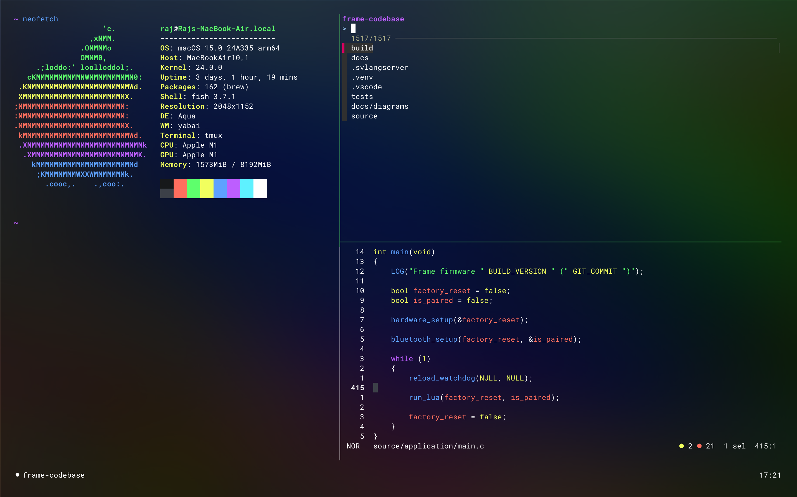

# 🌈 Welcome to my dotfiles 👨🏻‍💻

Curated development environment that I use on my machines. Follow these instructions if you'd like to set up something similar, otherwise simply explore the dotfiles for inspiration.

### Contents
1. [Initial MacOS Setup](#initial-macos-setup)
1. [Initial Arch Linux Setup](#initial-arch-linux-setup)
1. [The Good Stuff](#the-good-stuff)



## Initial MacOS Setup

1. Install Git

   ```sh
   xcode-select --install
   ```

1. Create a new ssh key

   ```sh
   ssh-keygen
   ```

## Initial Arch Linux Setup

1. Login as root and install Git

   ```sh
   ssh root@<remote.ip.address>
   pacman -Syu base-devel git --noconfirm
   ```

1. Edit the `/etc/sudoers` file to allow wheel users to use `sudo`

1. Create a user and close the connection

   ```sh
   useradd -m -G wheel raj
   passwd raj
   exit
   ```

1. Copy an ssh key from the host machine

   ```sh
   # Run this on host, not remote
   ssh-copy-id raj@<remote.ip.address>
   ```

1. SSH to the remote again as the new user

## The Good Stuff

1. Configure Git

   ```sh
   # Set up the git globals
   git config --global user.name "my name"
   git config --global user.email "mymail@gmail.com"
   git config --global core.excludesfile ~/.config/git/ignore
   ```

1. Install the [Homebrew](https://brew.sh) package manager

   ```sh
   /bin/bash -c "$(curl -fsSL https://raw.githubusercontent.com/Homebrew/install/HEAD/install.sh)"

   # Temporarily export brew to the PATH
   export PATH=$PATH:<whatever the above gave as the bin path>
   ```

1. Clone this repository into the `.config` folder

   ```sh
   mv ~/.config ~/old-config
   git clone --recursive https://github.com/siliconwitch/dotfiles.git ~/.config
   ```

1. Install applications:

   ```sh
   # MacOS only
   brew install \
      affinity-photo \
      google-chrome@dev \
      blender \
      cursor \
      discord \
      drawio \
      dropbox \
      figma \
      font-roboto-mono-nerd-font \
      ical-buddy \
      jq \
      karabiner-elements \
      kicad \
      koekeishiya/formulae/yabai \
      nordic-nrf-command-line-tools \
      obs \
      raspberry-pi-imager \
      raycast \
      saleae-logic \
      segger-jlink \
      steam \
      the-unarchiver \
      vlc \
      vnc-viewer \
      wezterm \
      xmind

   # MacOS & Linux
   brew install \
      arm-none-eabi-gcc \
      btop \
      cloc \
      fd \
      fish \
      fzf \
      gh \
      go \
      jq \
      koekeishiya/formulae/yabai \
      neofetch \
      python \
      tmux
   ```

1. Set default terminal to fish

   ```sh
   echo $(which fish) | sudo tee -a /etc/shells
   chsh -s $(which fish)

   # Remove bash and zsh related files if you like
   rm -r .bash*
   rm -r .zsh*
   ```

1. Other manually installed appsı

   - [1Blocker](https://apps.apple.com/se/app/1blocker-ad-blocker/id1365531024?l=en-GB)
   - [Cuprum](https://apps.apple.com/se/app/cuprum/id1088670425?l=en-GB&mt=12)
   - [DaVinci Resolve](https://apps.apple.com/se/app/davinci-resolve/id571213070?l=en-GB&mt=12)
   - [GIPHY Capture](https://apps.apple.com/se/app/giphy-capture-the-gif-maker/id668208984?l=en-GB&mt=12)
   - [Matlab](https://www.mathworks.com)
   - [SimNEC](http://www.ae6ty.com/smith_charts.html)
   - [Spark](https://apps.apple.com/se/app/spark-email-app-by-readdle/id1176895641?l=en-GB&mt=12)
   - [Things](https://apps.apple.com/se/app/things-3/id904280696?l=en-GB&mt=12)
   - [Waveforms](https://digilent.com/shop/software/digilent-waveforms/)


## Custom keyboard shortcuts

### MacOS windows

- `Capslock` - `Escape` if clicked, or `Ctrl` if held
- `Fn-Space` - Opens a new terminal
- `Fn-Enter` - Opens a new editor window
- `Fn-Escape` - Toggles tiling window manager off and on
- `Fn-b` - Balances titled windows
- `Fn-r` - Rotates tiled windows clockwise

### Fish

- `Ctrl-t` - Fuzzy change directory
- `Ctrl-r` - Fuzzy search history

### Tmux

- `Ctrl-n` - New window

- `Ctrl-a` `H` - Navigate to previous window
- `Ctrl-a` `L` - Navigate to next window

- `Ctrl-a` `Ctrl-h` - Split window left
- `Ctrl-a` `Ctrl-j` - Split window down
- `Ctrl-a` `Ctrl-k` - Split window up
- `Ctrl-a` `Ctrl-l` - Split window right

- `Ctrl-a` `h` - Navigate one pane left
- `Ctrl-a` `j` - Navigate one pane down
- `Ctrl-a` `k` - Navigate one pane up
- `Ctrl-a` `l` - Navigate one panel right

- `Ctrl-\` - Navigate to previous pane
- `Ctrl-a` `Ctrl-x` - Kill pane

- `Ctrl-a` `Shift-1` - Show US Pacific time
- `Ctrl-a` `Shift-2` - Show US Central time
- `Ctrl-a` `Shift-3` - Show US East Coast time
- `Ctrl-a` `Shift-8` - Show London time
- `Ctrl-a` `Shift-9` - Show Central European time
- `Ctrl-a` `Shift-0` - Show China time
- `Ctrl-a` `_` - Hide calendar
- `Ctrl-a` `+` - Show calendar and local time
